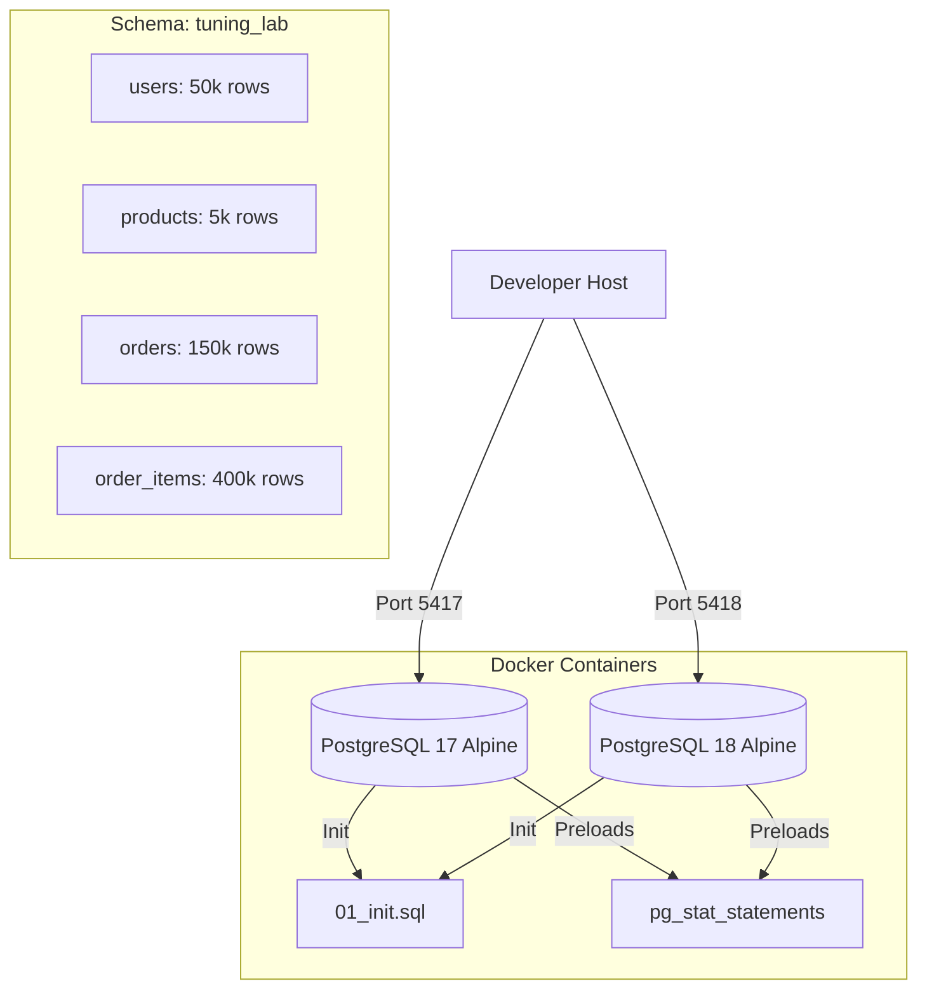

# PostgreSQL Performance Tuning Lab

Welcome to the **PostgreSQL Performance Tuning Lab**! This hands-on lab is designed to demonstrate how to identify, analyze, and resolve performance bottlenecks in PostgreSQL databases using the `pg_stat_statements` extension.

The lab is containerized using Docker, allowing you to test and compare workloads on both **PostgreSQL 17** and **PostgreSQL 18** side-by-side.

---

## 1. Lab Architecture & Design

The lab spins up two isolated PostgreSQL containers on different ports. Each container automatically runs a schema initialization and seeds approximately **600,000 records** to simulate a realistic production dataset.



### Port Mapping
*   **PostgreSQL 17**: `localhost:5417`
*   **PostgreSQL 18**: `localhost:5418`
*   **Credentials**: User: `postgres`, Password: `postgres`, Database: `tuning_lab`

---

## 2. Lab Directory Structure

```text
├── docker-compose.yml       # Launches PG17 & PG18 with preload config
├── init-scripts/
│   └── 01_init.sql          # Extension creation, schema definition, and mock data seeding
├── workloads/
│   ├── unoptimized_workload.sql  # Slow baseline pgbench queries (missing indexes, bad joins)
│   └── optimized_workload.sql    # Tuned pgbench queries (using index lookups & rewritten CTEs)
├── scripts/
│   ├── run_benchmark.sh     # Bash script executing pgbench inside containers
│   ├── analyze_queries.sql  # SQL metrics to inspect pg_stat_statements
│   ├── apply_tuning.sql     # SQL to create B-tree, composite, and GIN indexes
│   └── reset_stats.sql      # SQL to clear pg_stat_statements between runs
└── README.md                # This tuning guide
```

---

## 3. Getting Started

You can operate the entire lab using the provided `Makefile` shortcuts. To see all available commands, run:
```bash
make help
```

### Step 1: Start the Lab
Spin up the PostgreSQL 17 and 18 containers:
```bash
make up
# Alternative: docker compose up -d
```
*Note: The first startup takes about 10–15 seconds while PostgreSQL seeds the tables.*

Verify that the containers are healthy:
```bash
make status
# Alternative: docker compose ps
```

### Step 2: Confirm Seeding Completion
Verify the row counts in PostgreSQL 17 (or 18):
```bash
docker exec -i tuning_lab_pg17 psql -U postgres -d tuning_lab -c "
SELECT 'users' AS tbl, count(*) FROM users
UNION ALL SELECT 'products', count(*) FROM products
UNION ALL SELECT 'orders', count(*) FROM orders
UNION ALL SELECT 'order_items', count(*) FROM order_items;"
```

Expected output:
```text
     tbl     | count  
-------------+--------
 products    |   5000
 users       |  50000
 order_items | 400000
 orders      | 150000
```

---

## 4. The Performance Bottlenecks (Unoptimized Workload)

Our baseline application runs 5 queries that represent typical developer pitfalls:

1.  **Query 1 (Fetch user orders)**: `SELECT * FROM orders WHERE user_id = $1 ORDER BY order_date DESC;`
    *   *Problem*: Missing index on `orders.user_id`, causing a full table scan on 150,000 orders.
2.  **Query 2 (Wildcard description search)**: `SELECT id, name, price FROM products WHERE description LIKE '%sleek%' OR description LIKE '%durability%';`
    *   *Problem*: `LIKE '%pattern%'` is used without a trigram GIN index, forcing a full scan on `products`.
3.  **Query 3 (Aggregate sales)**: Aggregates order item quantity and revenue by product.
    *   *Problem*: Missing index on `order_items.product_id`, scanning 400,000 order item records every time.
4.  **Query 4 (Top spenders join)**: Joins `users` and `orders`, grouping by `users.username` and filtering by amount.
    *   *Problem*: Slow join on unindexed `orders.user_id`, hashing large text fields (`username`), and spilling to disk due to memory limits.
5.  **Query 5 (Correlated subqueries)**: Fetches totals and counts using two independent subqueries.
    *   *Problem*: Forces the database to scan `orders` *twice* for every single execution.

---

## 5. Step-by-Step Lab Walkthrough

### Step 1: Run the Unoptimized Workload
We will run a benchmark using 4 concurrent clients to populate `pg_stat_statements` with unoptimized metrics:

**On PostgreSQL 17:**
```bash
make run-unoptimized-17
# Alternative: ./scripts/run_benchmark.sh 17 unoptimized 20
```

**On PostgreSQL 18:**
```bash
make run-unoptimized-18
# Alternative: ./scripts/run_benchmark.sh 18 unoptimized 20
```

*Observe the output:* You will see throughput of around **28–31 TPS** (Transactions Per Second) and an average latency of **130–140 ms**.

---

### Step 2: Analyze Bottlenecks using `pg_stat_statements`
Run our analysis diagnostics. This pulls queries from `pg_stat_statements` sorted by total execution time:

**On PostgreSQL 17:**
```bash
make analyze-17
# Alternative: docker exec -i tuning_lab_pg17 psql -U postgres -d tuning_lab < scripts/analyze_queries.sql
```

**On PostgreSQL 18:**
```bash
make analyze-18
# Alternative: docker exec -i tuning_lab_pg18 psql -U postgres -d tuning_lab < scripts/analyze_queries.sql
```

Look at the **Top Queries by Total Execution Time**:
```text
 calls | total_time_ms | mean_time_ms | pct_of_total_time | full_query
-------+---------------+--------------+-------------------+-----------------------------
   434 |      44979.78 |       103.64 |             76.32 | SELECT u.username, COUNT(o.id)... FROM users u JOIN orders o...
   434 |       5455.93 |        12.57 |              9.26 | SELECT p.name, SUM(oi.quantity)... FROM order_items oi JOIN products p...
   434 |       5053.95 |        11.65 |              8.57 | SELECT u.id, u.username, (SELECT SUM(total_amount)...
   434 |       2585.76 |         5.96 |              4.39 | SELECT * FROM orders WHERE user_id = $1 ORDER BY order_date DESC
   434 |       1011.66 |         2.33 |              1.72 | SELECT id, name, price FROM products WHERE description LIKE $1...
```

#### Diagnostic Metrics to Watch:
*   `calls`: How many times the query was executed.
*   `total_time_ms`: Total execution time.
*   `mean_time_ms`: Average latency per run.
*   `pct_of_total_time`: The proportion of DB time consumed by this statement. If a query takes > 50%, it's your primary target!

---

### Step 3: Apply Database Optimizations
Now we apply standard index tuning. We create:
1.  B-tree indexes on foreign keys (`orders.user_id`, `order_items.order_id`, `order_items.product_id`).
2.  A composite index on `orders(user_id, total_amount)` to cover join + aggregate filters.
3.  A **GIN Trigram Index** (`pg_trgm`) on `products.description` to accelerate wildcard searches.
4.  Run `ANALYZE` to refresh statistics.

Run the tuning script:
```bash
# On PG 17:
make optimize-17
# Alternative: docker exec -i tuning_lab_pg17 psql -U postgres -d tuning_lab < scripts/apply_tuning.sql

# On PG 18:
make optimize-18
# Alternative: docker exec -i tuning_lab_pg18 psql -U postgres -d tuning_lab < scripts/apply_tuning.sql
```

---

### Step 4: Apply Query Rewriting
Index tuning is only half the battle. We also need to rewrite poorly designed queries:

*   **Query 4 (Aggregation before Join)**:
    Instead of joining all tables and grouping by the text column `u.username`, we use a Common Table Expression (CTE) to filter, aggregate, and limit by the integer `user_id` *first*, then join `users` for the top 10 results:
    ```sql
    WITH top_users AS (
        SELECT user_id, COUNT(id) as order_count, SUM(total_amount) as total_spent
        FROM orders
        WHERE total_amount > :min_amount
        GROUP BY user_id
        ORDER BY total_spent DESC
        LIMIT 10
    )
    SELECT u.username, tu.order_count, tu.total_spent
    FROM top_users tu
    JOIN users u ON tu.user_id = u.id
    ORDER BY tu.total_spent DESC;
    ```
*   **Query 5 (Left Join over Correlated Subqueries)**:
    Instead of scan-heavy nested subqueries, we fetch order data in a single LEFT JOIN:
    ```sql
    SELECT u.id, u.username, 
      COALESCE(SUM(o.total_amount), 0) as total_spent,
      COUNT(o.id) as total_orders
    FROM users u
    LEFT JOIN orders o ON o.user_id = u.id
    WHERE u.id = :userid
    GROUP BY u.id, u.username;
    ```

---

### Step 5: Run the Optimized Workload
Reset the statistics tracker first:
```bash
# On PG 17:
make reset-17
# Alternative: docker exec -i tuning_lab_pg17 psql -U postgres -d tuning_lab < scripts/reset_stats.sql

# On PG 18:
make reset-18
# Alternative: docker exec -i tuning_lab_pg18 psql -U postgres -d tuning_lab < scripts/reset_stats.sql
```

Now, execute the optimized workload benchmark:

**On PostgreSQL 17:**
```bash
make run-optimized-17
# Alternative: ./scripts/run_benchmark.sh 17 optimized 20
```

**On PostgreSQL 18:**
```bash
make run-optimized-18
# Alternative: ./scripts/run_benchmark.sh 18 optimized 20
```

*Results Analysis:*
*   Throughput jumps from **28 TPS to ~54 TPS** on PostgreSQL 17.
*   Average transaction latency drops from **139 ms to ~73 ms** (nearly a 50% improvement).

---

## 6. Advanced Performance Insights

### A. Memory Tuning (`work_mem`)
During Query 4 (Top spenders), if you check the query plan using `EXPLAIN ANALYZE`:
```bash
docker exec -i tuning_lab_pg17 psql -U postgres -d tuning_lab -c "
EXPLAIN ANALYZE SELECT u.username, COUNT(o.id), SUM(o.total_amount) 
FROM users u JOIN orders o ON u.id = o.user_id 
WHERE o.total_amount > 750 GROUP BY u.username LIMIT 10;"
```
You will notice the following line in the output:
```text
-> HashAggregate  (cost=14821.63..16839.58 rows=50000 width=50) (actual time=72.384..95.269 rows=45267 loops=1)
     Group Key: u.username
     Planned Partitions: 4  Batches: 5  Memory Usage: 8241kB  Disk Usage: 3504kB
```
*   **Disk Spill**: The hash table exceeded PostgreSQL's default `work_mem` (4MB), spilling 3.5MB of data to temporary files on disk.
*   **Optimization**: Try increasing `work_mem` to `32MB` in your session:
    ```sql
    SET work_mem = '32MB';
    ```
    This forces the `HashAggregate` to execute entirely in memory (`Batches: 1`), dropping execution time from **103 ms to 86 ms**.

### B. Index Selectivity
If we query `total_amount > 5000` (which is highly selective, returning only ~4.3% of rows), the query planner still defaults to a `Seq Scan` because it cannot use our composite index `(user_id, total_amount)` for filtering.

By creating an index specifically with `total_amount` as the leading column:
```sql
CREATE INDEX idx_orders_total_amount ON orders(total_amount);
```
The plan switches to a **Bitmap Index Scan**, dropping latency from **13.4 ms to 5.0 ms**, and reducing buffer reads from **2228 to 987 blocks**.

---

## 7. PostgreSQL 17 vs PostgreSQL 18 Plan Differences

One of the most interesting aspects of this lab is comparing how PostgreSQL 17 and 18 plan the optimized CTE query:

### PostgreSQL 17 Plan: Sequential Scan + HashAggregate
PostgreSQL 17 decides that a sequential scan on `orders` and hashing is cheapest:
*   **Execution Strategy**: Sequential scan on `orders` -> HashAggregate.
*   **I/O Cost**: `shared hit=2234` blocks (extremely low RAM block reads).
*   **Latency**: **~59.9 ms** (but uses disk temp files due to memory limits).

### PostgreSQL 18 Plan: Index Scan + GroupAggregate
PostgreSQL 18 prefers to read the data pre-sorted from the index, allowing a zero-memory-spill streaming aggregation:
*   **Execution Strategy**: Index Scan using `idx_orders_user_id` -> GroupAggregate.
*   **I/O Cost**: `shared hit=150095` blocks (very high buffer hit count).
*   **Latency**: **~72.5 ms** (slightly slower due to high CPU overhead of hitting 150k blocks in memory).

> [!NOTE]
> This comparison highlights a classic tuning trade-off: **Index scans are not always faster than sequential scans**. When a query accesses a large portion of a table (in this case, ~80% of orders), sequential page reads are faster than traversing the index tree and making random buffer cache hits, even if all pages are cached in RAM.

---

## 8. Cleaning Up

To stop the database containers and delete the seeded data volumes, run:
```bash
make down
# Alternative: docker compose down -v
```
This leaves your local workspace clean.